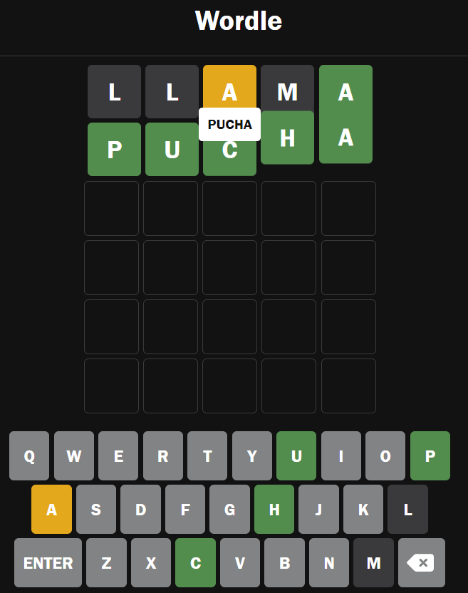

# WORDLE CLONE 
This project is a wordle clone made without dependencies (Only HTML, CSS, Vanilla JS).

## Skills worked in this project

- Display: Grid for the squares and Flex for the keyboard
- Animations: Rotate, pulse, and transform in Y axis
- Event Listeners

## TO DO 🎯
- Show keyboard ✅
- Create method to check if the word exists ✅
- Create method to check which letters are in the correct position ✅
- Add event onclick when a key is clicked ✅
- Create validations for keyboard events
    - Enter keyboard ✅
    - Erase keyboard ✅
- Animation when a letter is written ✅
- Animation when the word is completed ✅
- Animation when the word is correct ✅
- Fix method, when a letter is repeated in a word ✅
- Show correct word when game finished ✅
- Add alert when there are not enough letters ✅
- Add Win event
- Add game over event
- Add definition of the word modal
